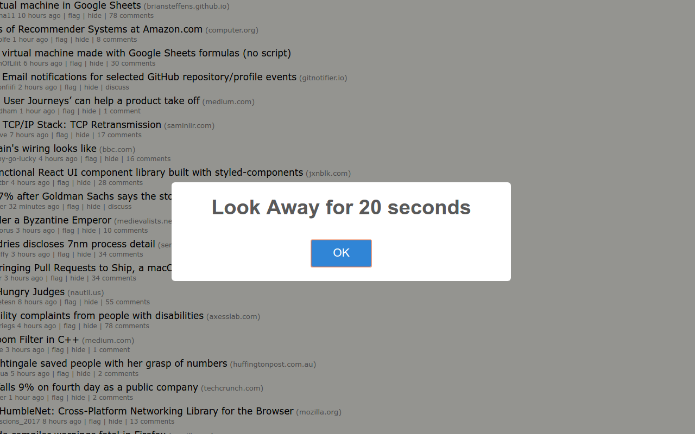

# Medusa

Medusa is a Chrome extension that reminds you to periodically look away from your computer screen.



## Inspiration

[How To Keep Computer Screens From Destroying Your Eyes (The Atlantic)](https://www.theatlantic.com/health/archive/2012/09/how-to-keep-computer-screens-from-destroying-your-eyes/263005/)

## Developing

### Built With
HTML, CSS, Javascript, Chrome Extension APIs

### Setting up

Here's how you can get set up:

*	First, fork the project

```shell
git clone https://github.com/<username>/medusa.git
cd medusa/
```

*	Go to `chrome://extensions`
*	Click "Load unpacked extension"
*	Browse to wherever you cloned the project and select that folder
*	Now you have a development version of Medusa running!

### Seeing your changes

After making changes to the extension, you will want to "Reload extensions" on 
the `chrome://extensions` page. (`Ctrl+R`)

### Publishing your Code

Go ahead and submit a Pull Request with:

*	Your changes to the code
*	An updated version number in `manifest.json`
*	Double-checking that your code matches the Style Guides below!

## Versioning

*	For a minor bug fix, increment version number in `manifest.json` by 0.0.1
*	For a new feature implementation, increment version number by 0.1.0
*	For a major feature implementation or behaviour change, increment version number by 1.0.0

## Style guide

*	Javascript: [Airbnb Style Guide](https://github.com/airbnb/javascript)
*	HTML/CSS: [Google HTML/CSS Style Guide](https://google.github.io/styleguide/htmlcssguide.html) with some overrides
	+	Don't follow [3.1.7](https://google.github.io/styleguide/htmlcssguide.html#Optional_Tags) (Optional Tags)

Pull Requests regarding code style are welcome and encouraged.

## Chrome API Reference

For your reference: [the Chrome APIs that are exposed to extensions](https://developer.chrome.com/extensions/api_index).

## Licensing

This project is licensed under the [MIT License](LICENSE). The MIT License is:

A short, permissive software license. Basically, you can do whatever you want as long as you include the original copyright and license notice in any copy of the software/source.

For more information about the MIT License: [tl;drLegal](https://www.tldrlegal.com/l/mit)
